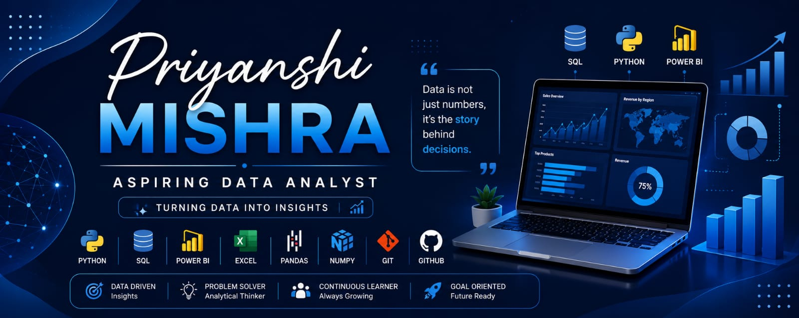

  

<h1 align="center">Hi 👋, I'm Priyanshi Mishra</h1>

<h3 align="center">Aspiring Data Analyst | Python | SQL | Power BI | AI Enthusiast</h3>

Passionate about transforming data into meaningful insights through analytics, visualization, and AI.

---

## 🚀 About Me

🎓 BCA Student at Shri Ramswaroop Memorial University.

I enjoy solving real-world business problems using **Python, SQL, and Power BI** while continuously improving my skills in **Data Analytics** and **Artificial Intelligence**. I love building practical projects, exploring data, and creating dashboards that support better decision-making.

- 📊 Aspiring Data Analyst
- 💻 Skilled in Python, SQL, Power BI & Excel
- 🤖 Interested in AI & Business Intelligence
- 🌱 Currently learning Advanced SQL, Power BI & AI
- 🤝 Open to internships and collaboration opportunities

---

## 🛠️ Tech Stack

---

## 📊 GitHub Stats

---

## 🔥 Contribution Streak

---

## 💻 Featured Projects

- 📊 Retail Business Analysis
- 🐍 ATM Management System
- 📈 Exploratory Data Analysis (EDA)
- 🗄️ SQL Sales Analysis
- 📊 Power BI Dashboards
- 🧮 Python Calculator

---

## 📜 Certifications

- Google Cloud – Introduction to Generative AI
- IBM – AI Fundamentals
- Microsoft Learn – Enhance Your Productivity with Prebuilt Microsoft 365 Copilot Agents
- Deloitte Australia – Data Analytics Job Simulation
- Forage – Generative AI Powered Data Analyst Job Simulation
- Forage – Data Visualization Job Simulation
- NPTEL – User-Centric Computing for Human-Computer Interaction

---

## 🏆 Achievements

- Built real-world Data Analytics projects using Python, SQL & Power BI
- Developed interactive dashboards and business reports
- Active GitHub portfolio with hands-on projects
- Regularly share technical projects and certifications on LinkedIn
- Participated in ICAT
- Microsoft Student Ambassador Learning Path Participant

---

## 📫 Connect With Me

💼 LinkedIn: www.linkedin.com/in/priyanshi-mishra-8ba043348
💻 GitHub: github.com/Priyanshi-mis

---

⭐ Thank you for visiting my GitHub profile! Feel free to explore my repositories and connect with me.

